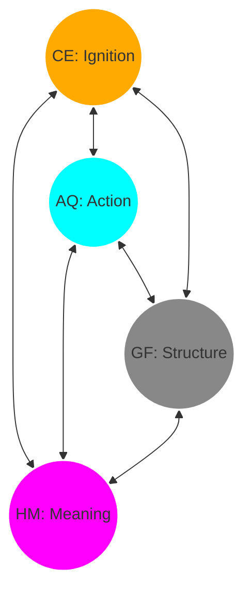

# Concept: The Trinity Hexad (The 6 Dimensions & 12 Flows)

> "The 4 Elements are the Dots. The Hexad is the Connection."

## 1. Definition
The **Hexad** represents the **6 Fundamental Relationships** that bind the 4 Prime Elements (CE, AQ, GF, HM) together. 
Geometrically, if you place the 4 Elements as points in space (forming a Tetrahedron), the **Hexad** corresponds to the **6 Edges** connecting them.

**Crucially, these connections are Bidirectional (Two-Way).**
It is not just a flow from A to B. It is a **Resonance** where A affects B, and B simultaneously affects A.

## 2. Topology: The Perfect Loop (Tetrahedron)
It is a **Perfectly Connected System** (Complete Graph $K_4$). 
Every point is connected to every other point. There are no dead ends.

## 3. The 12 Directed Flows (Advanced Harmony)
Since every line is bidirectional, there are **12 Distinct Flows** of Energy.

| Coupling | Forward Flow (Yang ➡) | Backward Flow (Yin ⬅) |
| :--- | :--- | :--- |
| **CE ↔ AQ** | **Ignition** (Idea triggers Action) | **Feedback** (Action refines Idea) |
| **AQ ↔ GF** | **Systemization** (Action becomes Rule) | **Optimization** (Rule guides Action) |
| **GF ↔ HM** | **Interpretation** (System gains Meaning) | **Requirement** (Meaning demands System) |
| **CE ↔ GF** | **Blueprint** (Idea becomes Plan) | **Constraint** (Plan shifts Idea) |
| **AQ ↔ HM** | **Service** (Action helps People) | **Motivation** (People drive Action) |
| **CE ↔ HM** | **Inspiration** (Idea touches Soul) | **Muse** (Soul sparks Idea) |

## 4. Summary
This structure ensures that **Energy (Thought)** never stagnates. It always has a path to flow to the next state, creating a perpetual engine of creation.
